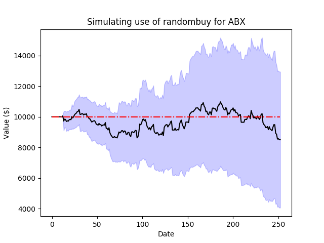
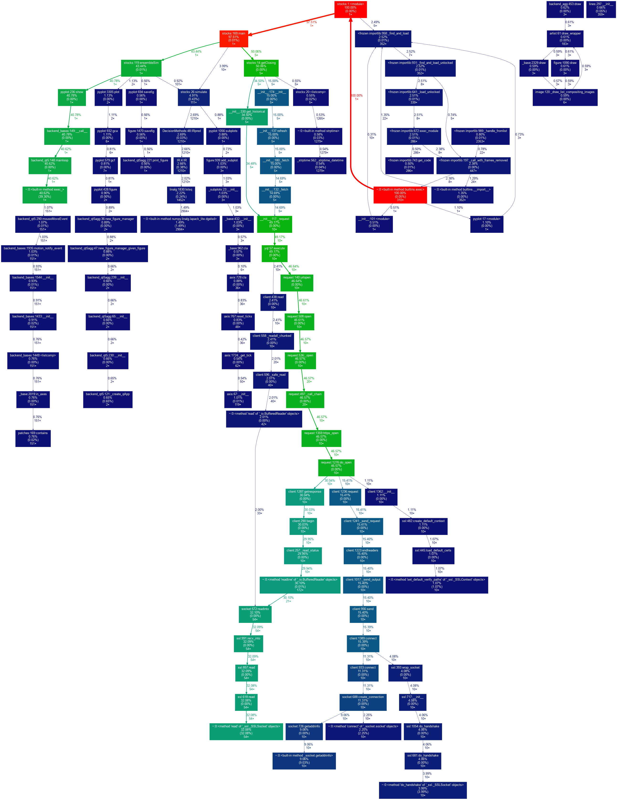

# StockForecast
Basic framework for using a variety of models to forecast and simulate stock market performance.

* * *

## To-Do ##
* Switch getopt to argparse
* Command line arguments for start and end dates
* Neural network model
* Add more performance metrics
  * Good/Total predictions
  * Performance vs random
  * Portfolio improvement as function of stock improvement
* Improve optimization code to avoid overfitting
* Add makefile for doxygen, include profiling graph (code here until then)
  * python -m cProfile -o logfile stocks.py
  * gprof2dot -f pstats logfile -o dotfile
  * dot dotfile -Tpng pngfile
* Figure out why S&P and DJIA seemingly observe different holidays
* Make documentation more doxygen friendly

## [Doxygen documentation](docs/html/index.html) ##

* * *

## History ##
* [April 4: Initial Commit](#april-4-2017)

### April 4, 2017 ###
Making the initial commit of this code to github. As it stands, the functionality ported over from my matlab stock framework is limited to linear and random models, but overall generalizability and functionality should be greatly expanded by using python. This also allows for installation on a server without another matlab license, which is nice.

Sample of the current state of predictions:

IR Model | Randombuy Model         
:--:|:--:
 | 

Working well at buying low and selling high short term, but definitely needs improvement in forecasting long term trends. Performance isn't great for stocks in continual decline (which makes sense, except previous nonlinear models have set high expectations for being able to avoid this problem).

Also, just for fun, the profiler graph of a run:

